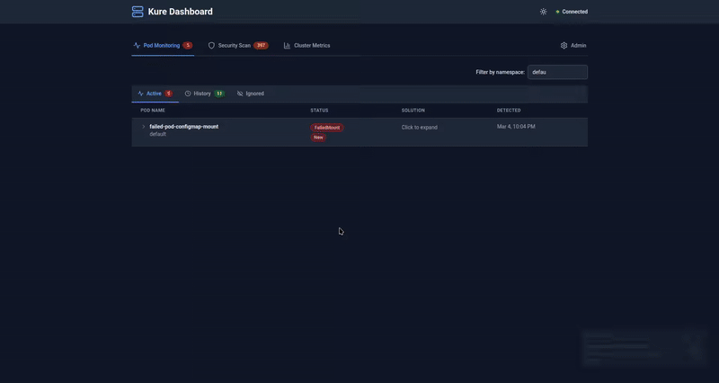

# Kure Monitor

[](https://artifacthub.io/packages/search?repo=kure-monitor)

> **Stop debugging Kubernetes failures manually — let AI analyze your pod crashes, image pull errors, and scheduling issues in seconds.**

Kure is a Kubernetes health monitoring tool that helps you understand **why** your workloads fail. When a pod crashes, gets stuck pending, or can't pull an image, Kure detects it instantly and provides AI-generated troubleshooting guidance to help you fix it fast. It also continuously scans your cluster for security misconfigurations and gives you a real-time overview of cluster resources — all from a single dashboard.


### Mirror Pod Testing

Deploy a temporary copy of a failing pod. Manually edit the manifest and deploy temporary pod to check if everything is working.



## Why Kure?

Unlike tools such as K8sGPT that are CLI-focused, Kure gives you a unified web dashboard combining real-time failure diagnosis, security scanning, and AI-powered fixes in one place. It also supports Ollama for fully local, air-gapped LLM inference — so your cluster data never leaves your network.

## Features

**Core Diagnosis**
- **AI-Powered Troubleshooting** — Get contextual solutions generated from pod events, logs, and manifest analysis using OpenAI, Anthropic, Groq, Google Gemini, GitHub Copilot (GitHub Models), or Ollama
- **Real-time Failure Detection** — Know immediately when pods enter CrashLoopBackOff, ImagePullBackOff, Pending, OOMKilled, or other failure states
- **Security Scanning** — 50+ checks including privileged containers, host namespace access, dangerous capabilities, missing seccomp/AppArmor profiles, root containers, RBAC misconfigurations, untrusted image registries, and missing resource limits
- **Pod Lifecycle Management** — Track pods through investigating, resolved, and ignored states with configurable history retention

**Dashboard**
- **Live Pod Logs** — Stream logs in real-time with container selection
- **Export Findings** — Export security findings to CSV, JSON, and PDF
- **Slack & Teams Notifications** — Get alerted when failures occur
- **Dashboard Authentication** — User accounts with read/write/admin roles, session cookies, and rate-limited login
- **Prometheus Metrics** — `/metrics` endpoint with optional ServiceMonitor support

## Limitations

Kure is focused on failure diagnosis, not general observability:

- **No Prometheus dependency** — Kure works standalone; it doesn't require or replace Prometheus
- **Not a metrics platform** — No time-series data, no alerting rules, no historical dashboards
- **Not a log aggregator** — Logs are fetched on-demand, not stored or indexed
- **Single cluster only** — Monitors one Kubernetes cluster per installation

Kure complements your existing observability stack (Prometheus, Grafana, Datadog) — it doesn't replace it.

## What's New in v2.3.0

- **BREAKING: Auth overhaul** - Legacy single-key `AUTH_API_KEY` / `auth.apiKey` model removed. The dashboard now uses user accounts: on first install, visitors are prompted to create an **admin** account, and further users are invited with **read**, **write**, or **admin** roles. Agent and security scanner authenticate to the backend with a separate shared `SERVICE_TOKEN`. The Helm chart auto-generates both secrets in a `<release>-bootstrap` Secret and preserves them across upgrades via `lookup`. See [docs/MIGRATING-2.2-TO-2.3.md](docs/MIGRATING-2.2-TO-2.3.md) for the upgrade guide.
- **BREAKING: Cluster metrics feature removed** - The Monitoring tab, cluster metrics ingestion, pod metrics history, and `metrics-server` requirement are gone. The agent no longer collects or reports metrics. The `agent.clusterMetrics` Helm values have been removed. Only `/api/metrics/security-scan-duration` (Prometheus scrape) remains.
- **New LLM provider: GitHub Copilot (GitHub Models)** - OpenAI-compatible via `https://models.github.ai/inference`, authenticated with a GitHub fine-grained PAT (Models permission). Aliases: `copilot`, `github`, `github_models`. Default model: `openai/gpt-5-mini`.
- **LLM provider model refresh** - Updated model catalogs:
  - OpenAI: `gpt-5`, `gpt-5-mini` (default), `gpt-4.1`
  - Anthropic: `claude-opus-4-5`, `claude-sonnet-4-5` (default), `claude-haiku-4-5`
  - Gemini: `gemini-2.5-pro`, `gemini-2.5-flash` (default), `gemini-2.5-flash-lite`
  - Ollama: `llama3.3`, `llama3.2` (default), `qwen2.5`
- **Fix: Admin user couldn't see Admin tab** - `/api/auth/me` returns `{user: {...}}` (wrapped), but `AuthContext.js` was calling `setUser(me)` directly so `user.role` was undefined and the Admin tab never rendered. Fixed by unwrapping `me.user` across all four auth flows (refresh, login, setup, accept-invitation).
- **Fix: Log-Aware Troubleshoot ordering** - The Log-Aware Troubleshoot section now renders above the AI-Generated Solution for CrashLoopBackOff / OOMKilled pods (was rendering below).

## Architecture

```
                         Kubernetes Cluster
  ┌────────────────────────────────────────────────────────────────┐
  │                                                                │
  │   ┌──────────────┐     ┌──────────────────┐     ┌───────────┐ │
  │   │    Agent     │────>│                  │<────│ Frontend  │ │
  │   │ (DaemonSet)  │ HTTP│     Backend      │ WS  │  (React)  │ │
  │   └──────┬───────┘     │    (FastAPI)     │     └───────────┘ │
  │          │             │                  │                    │
  │   ┌──────┴───────┐    │                  │                    │
  │   │   Security   │───>│                  │                    │
  │   │   Scanner    │HTTP└────────┬─────────┘                    │
  │   └──────┬───────┘             │                              │
  │          │                     │                              │
  │          │              ┌──────┴───────┐                      │
  │    K8s API Server       │  PostgreSQL  │                      │
  │   (watch pods,          │   Database   │                      │
  │    events, nodes)       └──────────────┘                      │
  │                                                                │
  └────────────────────────────────────────────────────────────────┘
                                   │
                                   │ API call
                                   ▼
                          ┌──────────────────┐
                          │   LLM Provider   │
                          │ OpenAI/Anthropic │
                          │ Groq/Gemini/     │
                          │ Copilot/Ollama   │
                          └──────────────────┘
```

**Data flow:**
1. **Agent** and **Security Scanner** watch the Kubernetes API for pod failures and security misconfigurations
2. They report findings to the **Backend** via HTTP
3. **Backend** generates AI solutions using the configured LLM provider (or falls back to rule-based solutions)
4. **Backend** stores results in **PostgreSQL** and pushes real-time updates to the **Frontend** via WebSocket
5. **Frontend** displays the dashboard with live updates

**Components:**

| Component | Type | Description |
|-----------|------|-------------|
| **Agent** | DaemonSet | Watches K8s API for pod failures (CrashLoopBackOff, ImagePullBackOff, Pending, OOMKilled) |
| **Security Scanner** | Deployment | Audits pods for 50+ security misconfigurations with real-time change detection |
| **Backend** | Deployment | FastAPI server — receives reports, generates AI solutions, serves API and WebSocket |
| **Frontend** | Deployment | React dashboard with real-time updates via WebSocket |
| **PostgreSQL** | StatefulSet | Stores failure history, security findings, and configuration |

## Quick Start

### Prerequisites
- Kubernetes cluster (1.20+)
- kubectl configured
- Helm 3.x (recommended)

### Deploy with Helm (Recommended)

```bash
# Add the Helm repository
helm repo add kure-monitor https://nan0c0de.github.io/kure-monitor/
helm repo update

# Install Kure Monitor
helm install kure-monitor kure-monitor/kure \
  --namespace kure-system \
  --create-namespace
```

After installation, configure your LLM provider (OpenAI, Anthropic, Groq, Google Gemini, GitHub Copilot, or Ollama) via the Admin panel in the web dashboard to enable AI-powered solutions.

### Production Install

```bash
helm install kure-monitor kure-monitor/kure \
  --namespace kure-system \
  --create-namespace \
  --set postgresql.password="$(openssl rand -hex 24)"
```

On first visit, the dashboard will prompt you to create the initial admin
account (username + password). Invite additional users from the Admin panel
with **read** or **write** roles as needed.

### Access the Dashboard

```bash
# Via port-forward (recommended for testing)
kubectl port-forward svc/kure-monitor-frontend 8080:8080 -n kure-system
# Open http://localhost:8080

# OR via NodePort
kubectl get svc -n kure-system
# Access via http://<node-ip>:<nodePort>
```

## Configuration

### LLM Configuration (Admin Panel)

LLM provider is configured via the Admin panel in the web dashboard after installation. No API key is required during helm install.

### Supported LLM Providers

| Provider | Alias | Default Model |
|----------|-------|---------------|
| **Ollama** (local) | `ollama` | `llama3.2` |
| **OpenAI** | `openai` | `gpt-5-mini` |
| **Anthropic** | `anthropic`, `claude` | `claude-sonnet-4-5` |
| **Groq** | `groq`, `groq_cloud` | `meta-llama/llama-4-scout-17b-16e-instruct` |
| **Google Gemini** | `gemini`, `google` | `gemini-2.5-flash` |
| **GitHub Copilot** (GitHub Models) | `copilot`, `github`, `github_models` | `openai/gpt-5-mini` |

**GitHub Copilot notes:** authenticates with a GitHub Personal Access Token
(fine-grained, `Models` permission). Defaults to base URL
`https://models.github.ai/inference` and exposes an OpenAI-compatible API.
Example models: `openai/gpt-5`, `openai/gpt-5-mini`, `anthropic/claude-sonnet-4`.

### Key Helm Values

```yaml
agent:
  pendingGracePeriod: 120   # Seconds before reporting Pending pods

postgresql:
  external: false            # Set true to use external PostgreSQL
  password: "change-me"      # Change in production

prometheus:
  enabled: false             # Enable Prometheus scraping network policy
  serviceMonitor:
    enabled: false           # Create ServiceMonitor (requires Prometheus Operator)
```

See [`helm/README.md`](helm/README.md) for the full parameter reference.

## Dashboard Features

### Pod Failures Tab
- Real-time pod failure detection
- AI-generated or rule-based solutions
- Expandable details with events, logs, and manifest
- Pod lifecycle states: investigating, resolved, ignored
- Dismiss/restore with configurable history retention
- Retry AI solution generation

### Security Tab
- 50+ security misconfiguration checks
- Severity-based filtering (Critical, High, Medium, Low)
- AI-generated remediation suggestions
- Export findings to CSV, JSON, and PDF
- Manual rescan button for on-demand re-scanning
- Trusted container registries to suppress untrusted registry findings
- Rule exclusions with global and per-namespace scopes

### Admin Panel
- **AI Config** — Configure LLM provider (OpenAI, Anthropic, Groq, Google Gemini, GitHub Copilot, or Ollama)
- **Notifications** — Configure Slack or Microsoft Teams webhooks for alerts
- **Exclusions** — Exclude namespaces, pods, and security rules from monitoring
- **Trusted Registries** — Mark container registries as trusted to filter findings
- **History** — Configure retention for resolved and ignored pods

## Monitoring and Troubleshooting

### Check System Status
```bash
# Pod status
kubectl get pods -n kure-system

# View logs
kubectl logs -l app.kubernetes.io/component=backend -n kure-system
kubectl logs -l app.kubernetes.io/component=agent -n kure-system
kubectl logs -l app.kubernetes.io/component=security-scanner -n kure-system
kubectl logs -l app.kubernetes.io/component=frontend -n kure-system
```

## Authentication

Kure Monitor uses **user accounts** for the dashboard and a separate **service token** for agent/scanner traffic. Both are wired up automatically by the Helm chart -- there is nothing to configure at install time.

### Dashboard (user accounts)

- On first visit, the dashboard prompts you to create the initial **admin** account (username + password).
- Once signed in, invite additional users from the Admin panel and assign a role:

  | Role  | Permissions |
  |-------|-------------|
  | `read`  | View pod failures and security findings. No mutating actions. |
  | `write` | Everything `read` can do, plus dismiss/resolve pods, trigger rescans, edit suppressions. |
  | `admin` | Everything `write` can do, plus user management, LLM provider config, notification settings. |

- Sessions use an HttpOnly `kure_session` cookie signed with `SESSION_SECRET`. Login attempts are rate-limited.
- For multi-replica backends, pre-provision `SESSION_SECRET` via the bootstrap Secret (the Helm chart does this for you) so cookies stay valid across replicas.

### Service-to-service (agent + security scanner)

- Agent and scanner authenticate to the backend with a shared `SERVICE_TOKEN`, sent as the `X-Service-Token` HTTP header (and as `?token=` on WebSocket connections).
- The Helm chart auto-generates this token in a Secret named `<release>-bootstrap` on first install and preserves it on upgrade.

### Rotating the service token

```bash
# Edit the Secret in place (or kubectl create secret ... --dry-run=client -o yaml | kubectl apply -f -)
kubectl edit secret kure-monitor-bootstrap -n kure-system

# Restart the pods that read it
kubectl rollout restart deployment/kure-monitor-backend deployment/kure-monitor-security-scanner -n kure-system
kubectl rollout restart daemonset/kure-monitor-agent -n kure-system
```

Rotating `session-secret` the same way will sign all existing dashboard users out and force them to log in again.

## Security

- **Authentication** — User-account auth (read/write/admin roles) for the dashboard; shared `SERVICE_TOKEN` for agent/scanner -> backend traffic
- All components run as non-root users (UID 1001)
- Network policies restrict inter-pod communication
- RBAC limits agent and scanner permissions to read-only access
- Security contexts prevent privilege escalation with read-only root filesystem
- Seccomp profiles enabled (RuntimeDefault)

## License

Licensed under the [Apache License 2.0](LICENSE).

"Kure Monitor" is a trademark of Igor Koricanac. See [LICENSE](LICENSE) for trademark details.
