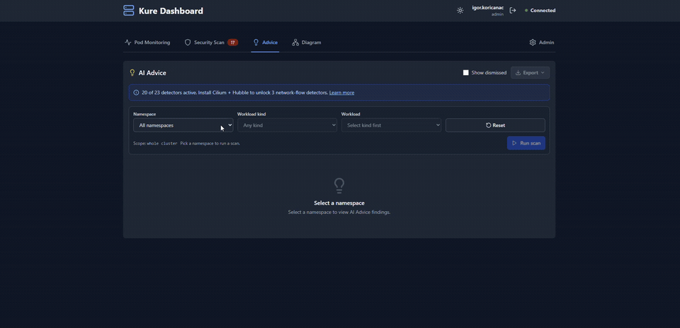
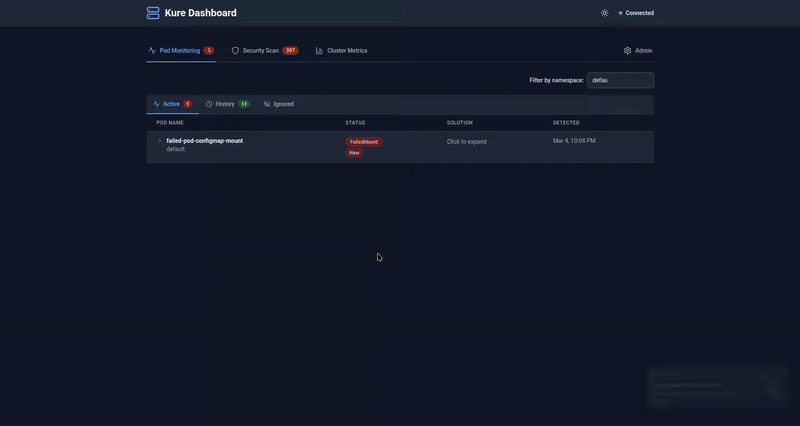

# Kure Monitor

[](https://artifacthub.io/packages/search?repo=kure-monitor)

> **Stop debugging Kubernetes failures manually — let AI analyze your pod crashes, image pull errors, and scheduling issues in seconds.**

Kure is a Kubernetes health monitoring tool that helps you understand **why** your workloads fail. When a pod crashes, gets stuck pending, or can't pull an image, Kure detects it instantly and provides AI-generated troubleshooting guidance to help you fix it fast. It also continuously scans your cluster for security misconfigurations and gives you a real-time overview of cluster resources — all from a single dashboard.


### AI Advice

Scan running, healthy workloads — and cluster flows — for architectural mismatches a passing readiness probe will never surface. Kure suggests concrete improvements, each with rule-based evidence and a plain-language explanation of *why* it matters.



### Mirror Pod Testing

Deploy a temporary copy of a failing pod. Manually edit the manifest and deploy temporary pod to check if everything is working.



## Why Kure?

Unlike tools such as K8sGPT that are CLI-focused, Kure gives you a unified web dashboard combining real-time failure diagnosis, security scanning, and AI-powered fixes in one place. It also supports Ollama for fully local, air-gapped LLM inference — so your cluster data never leaves your network.

## Features

**Core Diagnosis**
- **AI-Powered Troubleshooting** — Get contextual solutions generated from pod events, logs, and manifest analysis using OpenAI, Anthropic, Groq, Google Gemini, GitHub Copilot (GitHub Models), or Ollama
- **Real-time Failure Detection** — Know immediately when pods enter CrashLoopBackOff, ImagePullBackOff, Pending, OOMKilled, or other failure states
- **Security Scanning** — 50+ checks including privileged containers, host namespace access, dangerous capabilities, missing seccomp/AppArmor profiles, root containers, RBAC misconfigurations, untrusted image registries, and missing resource limits
- **Pod Lifecycle Management** — Track pods through investigating, resolved, and ignored states with configurable history retention

**Dashboard**
- **Diagram Tab** — Interactive Kubernetes topology graph. Switch between per-namespace and per-workload views, click any node to view its manifest, click an edge to focus that path (highlights ancestors and descendants, dims everything else)
- **Live Pod Logs** — Stream logs in real-time with container selection
- **Export Findings** — Export security findings to CSV, JSON, and PDF
- **Slack & Teams Notifications** — Get alerted when failures occur
- **Dashboard Authentication** — User accounts with read/write/admin roles, session cookies, and rate-limited login
- **Prometheus Metrics** — `/metrics` endpoint with optional ServiceMonitor support

## Limitations

Kure is focused on failure diagnosis, not general observability:

- **No Prometheus dependency** — Kure works standalone; it doesn't require or replace Prometheus
- **Not a metrics platform** — No time-series data, no alerting rules, no historical dashboards
- **Not a log aggregator** — Logs are fetched on-demand, not stored or indexed
- **Single cluster only** — Monitors one Kubernetes cluster per installation

Kure complements your existing observability stack (Prometheus, Grafana, Datadog) — it doesn't replace it.

## What's New in v2.4.3

- **AI Advice now ships 38 detectors** (up from 23). Sixteen new detectors landed across resource hygiene (`missing-requests-limits`, `requests-equal-limits-burstable`, `cpu-limit-throttling-risk`, `oom-prone-memory-headroom`), scheduling/availability (`missing-pod-anti-affinity-replicas`, `missing-topology-spread-constraints`, `single-replica-behind-service`, `missing-priority-class`), networking (`service-target-port-mismatch`, `ingress-host-collision`, `networkpolicy-selects-nothing`), lifecycle (`prestop-missing-short-grace`, `job-restart-policy-mismatch`, `image-pull-always-with-mutable-tag`), and storage (`pvc-no-storage-class`, `rwo-pvc-multi-replica`).
- **Active / Ignored tabs in AI Advice.** The "Show dismissed" checkbox is gone. Findings now live under Active and Ignored tabs with live counts, optimistic dismiss/restore, tab-aware exports, and tab-aware WebSocket upserts — matching the Pod Monitoring tab's pattern.
- **Fix: `referenced-config-missing` detector removed.** It false-positived on every Secret reference because the backend has no Secret-read RBAC by design. Genuinely missing ConfigMap/Secret references are already reported by the pod-watcher as `CreateContainerConfigError` with better evidence and timing.
- **No breaking changes.** No RBAC updates, no schema migration. Drop-in upgrade.

## What's New in v2.4.1

- **Optional feature toggles** - The four dashboard features can now be enabled or disabled individually via Helm values. All four default to `true`, so existing deployments behave identically — opt in to slim things down by setting any of these to `false`:
  ```yaml
  features:
    podMonitoring: true   # gates the agent DaemonSet + its RBAC/NetworkPolicy + Pod Monitoring tab
    securityScan: true    # gates the security-scanner Deployment + its RBAC/NetworkPolicy + Security Scan tab
    diagram: true         # gates the Diagram tab (backend keeps the API)
    aiAdvice: true        # gates the Advice tab (backend keeps the API)
  ```
  Disabling a feature hides its dashboard tab and, where applicable, skips deploying the workloads, RBAC, and NetworkPolicies dedicated to it. The backend keeps its APIs for the Diagram and Advice features so re-enabling is just a Helm value flip.
- **No breaking changes.** Drop-in upgrade; no operator action required.

## What's New in v2.4.0

- **New: AI Advice tab** - A new "Advice" tab in the dashboard, scoped per namespace (and optionally per workload / pod). Selecting a namespace auto-runs a scan; narrowing to a workload requires an explicit **Run scan** click. **23 detectors** ship out of the box across scaling, reliability, networking, data, config, capacity, scheduling, supply-chain, and startup categories — 7 original + 16 added in this release. Findings can be exported to JSON or CSV.
- **Two layers of detection** - **Layer 1 (20 of 23)** is manifest-only and works with the backend's existing K8s permissions. **Layer 2 (3-4 of 23)** requires Cilium Hubble (`fan-out-pattern`, `websocket-on-deployment`, `all-to-all-replicas`, `ephemeral-processes`). The Hubble client is currently a stub; the panel shows a **Needs Hubble** badge on those detectors and a coverage banner at the top.
- **LLM cost optimisation** - Scans persist findings with `explanation: null`. Cards collapse by default; expanding a card lazily calls `POST /api/advice/findings/{id}/explain`, which generates and caches the explanation (idempotent — re-expand never re-calls). The explainer prompt is constrained against invention: no replica counts, image names, container names, ports, or labels that are not in the finding's `evidence` dict.
- **Detector Settings admin modal** - Enable/disable any detector, grouped by category, with search and bulk **Enable all** / **Disable all** / **Reset to defaults**. Hubble-gated detectors are visually marked and their toggles disable when Hubble is unavailable.
- **PostgreSQL resources renamed** - StatefulSet, Service, Secret, and ConfigMap now use the `kure-monitor-` prefix (e.g. `kure-monitor-postgresql`). **Operator action:** `helm upgrade` handles the rename. The old PVC is orphaned and can be deleted; data does not carry over (rebuild-empty migration).
- **Role consolidation** - The three-role system (`admin` / `write` / `read`) collapsed to two (`admin` / `member`). The DB migration is idempotent — existing `read` / `write` users are auto-mapped to `member` on first backend boot. No manual action needed.
- **Login rate limiting is now DB-backed** (`login_attempts` table) so all backend replicas share state.
- **Agent WebSocket auth defaults to `X-Service-Token` header** instead of `?token=` query param, so the secret never lands in proxy / access logs. Falls back to query-param with `AGENT_AUTH_VIA_HEADER=false` / `SCANNER_AUTH_VIA_HEADER=false`. Agent WS reconnects now use exponential backoff with jitter (`AGENT_WS_RECONNECT_MAX_SECONDS`, `AGENT_WS_HEARTBEAT_SECONDS`).
- **Defensive cleanup across all four services** - Pydantic v2 migration, `asyncio.to_thread` / `asyncio.Lock` / `asyncio.wait_for` on K8s API calls, shared `aiohttp.ClientSession`, async shutdown lifecycle in the scanner. Several frontend modals adopted a shared `useModalA11y` hook (role=dialog, aria-modal, focus trap, Escape close, backdrop click close).
- **Tab order** - Monitoring → Security → **Advice** → Diagram → Admin.

## What's New in v2.3.4

- **Default LLM provider is now Groq** - The AI Configuration panel now lands new users on Groq pre-selected (was Ollama). Existing installations are unaffected; provider stays whatever you have configured.
- **Model lists refreshed across all providers** - Frontend dropdowns and backend `default_model()` updated to current (May 2026) latest models:
  - **OpenAI**: `gpt-5.5`, `gpt-5.5-mini` (default), `gpt-5.4-mini`
  - **Anthropic**: `claude-opus-4-7`, `claude-sonnet-4-6` (default), `claude-haiku-4-5`
  - **Google Gemini**: `gemini-3.1-pro`, `gemini-3-flash` (default), `gemini-3.1-flash-lite`
  - **Groq**: `openai/gpt-oss-120b`, `meta-llama/llama-4-scout-17b-16e-instruct` (default), `llama-3.3-70b-versatile`, `openai/gpt-oss-20b`
  - **Ollama**: `llama4:scout` (default), `llama3.3`, `qwen3`
  - **GitHub Copilot (GitHub Models)**: `openai/gpt-5.5`, `openai/gpt-5.5-mini` (default), `anthropic/claude-sonnet-4-6`
- **No RBAC or breaking changes.** Drop-in upgrade; no operator action required.

## What's New in v2.3.3

- **New: Roles mode in the Diagram tab** - RBAC-focused topology graph. Pick a Role (in a namespace) or a ClusterRole and the diagram renders the Role/ClusterRole, its bindings, the synthesized Permission nodes (one per `(apiGroup, resource)` tuple, with verbs and `resourceNames` in the node), and the Subjects (`User`, `Group`, `ServiceAccount`) the Role is bound to. Click a real RBAC object to see its live manifest; click a synthesized Permission or Subject to see a summary panel built from the data already on the node.
- **Backend: RBAC topology endpoints** - Three new `/api/diagram/*` endpoints (`/diagram/roles`, `/diagram/role/{ns}/{name}`, `/diagram/clusterrole/{name}`) gated by `require_read`. The diagram manifest endpoint now also serves `Role`, `ClusterRole`, `RoleBinding`, `ClusterRoleBinding`, and `ServiceAccount` (synthesized `Permission` / `Subject:*` kinds are rejected with HTTP 400 as they have no underlying manifest).
- **OPERATOR ACTION REQUIRED: Reapply RBAC** - The backend ClusterRole now needs `get` / `list` on `roles`, `clusterroles`, `rolebindings`, and `clusterrolebindings` in `rbac.authorization.k8s.io`. Run `kubectl apply -f k8s/rbac.yaml` (raw manifests) or `helm upgrade` (Helm) after upgrading. Without it the Roles mode returns HTTP 403; the rest of the dashboard is unaffected.

## What's New in v2.3.2

- **New: Diagram tab** - Interactive Kubernetes topology graph with two view modes (per-namespace and per-workload). The graph is built from owner refs, label selectors, service-to-endpoints relationships, ingress backends, HPA targets, NetworkPolicy selectors, and volume / envFrom references. Click any node to view its manifest in a side panel; click any edge to focus on that path -- ancestors and descendants stay highlighted while everything else dims. Click again or click the background to clear. Nodes are grouped by `app.kubernetes.io/name` (or `app`) label and groups can be collapsed.
- **Backend: topology service** - New `/api/diagram/*` endpoints (namespaces list, per-namespace graph, per-workload graph, manifest fetch). Deterministic graph builder with a 15s in-memory cache and EndpointSlice -> Endpoints fallback. Gated by `require_read`.
- **Security by design: no Secret reads** - The backend ServiceAccount is intentionally NOT granted access to `secrets`. Secret nodes are derived purely from workload spec references; the manifest endpoint hard-rejects `kind=Secret` with HTTP 403 and the UI shows a "no read access by design" info banner instead of the manifest body.
- **OPERATOR ACTION REQUIRED: Reapply RBAC** - The backend ClusterRole has been expanded to support the topology graph. New verbs on `namespaces`, `services`, `endpoints`, `configmaps`, `persistentvolumeclaims`, `serviceaccounts`, `replicasets / statefulsets / daemonsets` (apps), `jobs / cronjobs` (batch), `ingresses / networkpolicies` (networking.k8s.io), `endpointslices` (discovery.k8s.io), and `horizontalpodautoscalers` (autoscaling). Run `kubectl apply -f k8s/rbac.yaml` (raw manifests) or `helm upgrade` (Helm) after upgrading.

## What's New in v2.3.0

- **BREAKING: Auth overhaul** - Legacy single-key `AUTH_API_KEY` / `auth.apiKey` model removed. The dashboard now uses user accounts: on first install, visitors are prompted to create an **admin** account, and further users are invited with **read**, **write**, or **admin** roles. Agent and security scanner authenticate to the backend with a separate shared `SERVICE_TOKEN`. The Helm chart auto-generates both secrets in a `<release>-bootstrap` Secret and preserves them across upgrades via `lookup`. See [docs/MIGRATING-2.2-TO-2.3.md](docs/MIGRATING-2.2-TO-2.3.md) for the upgrade guide.
- **BREAKING: Cluster metrics feature removed** - The Monitoring tab, cluster metrics ingestion, pod metrics history, and `metrics-server` requirement are gone. The agent no longer collects or reports metrics. The `agent.clusterMetrics` Helm values have been removed. Only `/api/metrics/security-scan-duration` (Prometheus scrape) remains.
- **New LLM provider: GitHub Copilot (GitHub Models)** - OpenAI-compatible via `https://models.github.ai/inference`, authenticated with a GitHub fine-grained PAT (Models permission). Aliases: `copilot`, `github`, `github_models`. Default model: `openai/gpt-5-mini`.
- **LLM provider model refresh** - Updated model catalogs:
  - OpenAI: `gpt-5`, `gpt-5-mini` (default), `gpt-4.1`
  - Anthropic: `claude-opus-4-5`, `claude-sonnet-4-5` (default), `claude-haiku-4-5`
  - Gemini: `gemini-2.5-pro`, `gemini-2.5-flash` (default), `gemini-2.5-flash-lite`
  - Ollama: `llama3.3`, `llama3.2` (default), `qwen2.5`
- **Fix: Admin user couldn't see Admin tab** - `/api/auth/me` returns `{user: {...}}` (wrapped), but `AuthContext.js` was calling `setUser(me)` directly so `user.role` was undefined and the Admin tab never rendered. Fixed by unwrapping `me.user` across all four auth flows (refresh, login, setup, accept-invitation).
- **Fix: Log-Aware Troubleshoot ordering** - The Log-Aware Troubleshoot section now renders above the AI-Generated Solution for CrashLoopBackOff / OOMKilled pods (was rendering below).

## Architecture

```
                         Kubernetes Cluster
  ┌────────────────────────────────────────────────────────────────┐
  │                                                                │
  │   ┌──────────────┐     ┌──────────────────┐     ┌───────────┐ │
  │   │    Agent     │────>│                  │<────│ Frontend  │ │
  │   │ (DaemonSet)  │ HTTP│     Backend      │ WS  │  (React)  │ │
  │   └──────┬───────┘     │    (FastAPI)     │     └───────────┘ │
  │          │             │                  │                    │
  │   ┌──────┴───────┐    │                  │                    │
  │   │   Security   │───>│                  │                    │
  │   │   Scanner    │HTTP└────────┬─────────┘                    │
  │   └──────┬───────┘             │                              │
  │          │                     │                              │
  │          │              ┌──────┴───────┐                      │
  │    K8s API Server       │  PostgreSQL  │                      │
  │   (watch pods,          │   Database   │                      │
  │    events, nodes)       └──────────────┘                      │
  │                                                                │
  └────────────────────────────────────────────────────────────────┘
                                   │
                                   │ API call
                                   ▼
                          ┌──────────────────┐
                          │   LLM Provider   │
                          │ OpenAI/Anthropic │
                          │ Groq/Gemini/     │
                          │ Copilot/Ollama   │
                          └──────────────────┘
```

**Data flow:**
1. **Agent** and **Security Scanner** watch the Kubernetes API for pod failures and security misconfigurations
2. They report findings to the **Backend** via HTTP
3. **Backend** generates AI solutions using the configured LLM provider (or falls back to rule-based solutions)
4. **Backend** stores results in **PostgreSQL** and pushes real-time updates to the **Frontend** via WebSocket
5. **Frontend** displays the dashboard with live updates

**Components:**

| Component | Type | Description |
|-----------|------|-------------|
| **Agent** | DaemonSet | Watches K8s API for pod failures (CrashLoopBackOff, ImagePullBackOff, Pending, OOMKilled) |
| **Security Scanner** | Deployment | Audits pods for 50+ security misconfigurations with real-time change detection |
| **Backend** | Deployment | FastAPI server — receives reports, generates AI solutions, serves API and WebSocket |
| **Frontend** | Deployment | React dashboard with real-time updates via WebSocket |
| **PostgreSQL** | StatefulSet | Stores failure history, security findings, and configuration |

## Quick Start

### Prerequisites
- Kubernetes cluster (1.20+)
- kubectl configured
- Helm 3.x (recommended)

### Deploy with Helm (Recommended)

```bash
# Add the Helm repository
helm repo add kure-monitor https://igor-koricanac.github.io/kure-monitor/
helm repo update

# Install Kure Monitor
helm install kure-monitor kure-monitor/kure \
  --namespace kure-system \
  --create-namespace \
  --set postgresql.password="$(openssl rand -hex 24)"
```

After installation, configure your LLM provider (OpenAI, Anthropic, Groq, Google Gemini, GitHub Copilot, or Ollama) via the Admin panel in the web dashboard to enable AI-powered solutions.

On first visit, the dashboard will prompt you to create the initial admin
account (username + password). Invite additional users from the Admin panel
with **read** or **write** roles as needed.

### Access the Dashboard

```bash
# Via port-forward (recommended for testing)
kubectl port-forward svc/kure-monitor-frontend 8080:8080 -n kure-system
# Open http://localhost:8080

# OR via NodePort
kubectl get svc -n kure-system
# Access via http://<node-ip>:<nodePort>
```

## Configuration

### LLM Configuration (Admin Panel)

LLM provider is configured via the Admin panel in the web dashboard after installation. No API key is required during helm install.

### Supported LLM Providers

| Provider | Alias | Default Model |
|----------|-------|---------------|
| **Ollama** (local) | `ollama` | `llama3.2` |
| **OpenAI** | `openai` | `gpt-5-mini` |
| **Anthropic** | `anthropic`, `claude` | `claude-sonnet-4-5` |
| **Groq** | `groq`, `groq_cloud` | `meta-llama/llama-4-scout-17b-16e-instruct` |
| **Google Gemini** | `gemini`, `google` | `gemini-2.5-flash` |
| **GitHub Copilot** (GitHub Models) | `copilot`, `github`, `github_models` | `openai/gpt-5-mini` |

**GitHub Copilot notes:** authenticates with a GitHub Personal Access Token
(fine-grained, `Models` permission). Defaults to base URL
`https://models.github.ai/inference` and exposes an OpenAI-compatible API.
Example models: `openai/gpt-5`, `openai/gpt-5-mini`, `anthropic/claude-sonnet-4`.

### Key Helm Values

```yaml
agent:
  pendingGracePeriod: 120   # Seconds before reporting Pending pods

postgresql:
  external: false            # Set true to use external PostgreSQL
  password: "change-me"      # Change in production

prometheus:
  enabled: false             # Enable Prometheus scraping network policy
  serviceMonitor:
    enabled: false           # Create ServiceMonitor (requires Prometheus Operator)
```

See [`helm/README.md`](helm/README.md) for the full parameter reference.

## Dashboard Features

### Pod Failures Tab
- Real-time pod failure detection
- AI-generated or rule-based solutions
- Expandable details with events, logs, and manifest
- Pod lifecycle states: investigating, resolved, ignored
- Dismiss/restore with configurable history retention
- Retry AI solution generation

### Security Tab
- 50+ security misconfiguration checks
- Severity-based filtering (Critical, High, Medium, Low)
- AI-generated remediation suggestions
- Export findings to CSV, JSON, and PDF
- Manual rescan button for on-demand re-scanning
- Trusted container registries to suppress untrusted registry findings
- Rule exclusions with global and per-namespace scopes

### Admin Panel
- **AI Config** — Configure LLM provider (OpenAI, Anthropic, Groq, Google Gemini, GitHub Copilot, or Ollama)
- **Notifications** — Configure Slack or Microsoft Teams webhooks for alerts
- **Exclusions** — Exclude namespaces, pods, and security rules from monitoring
- **Trusted Registries** — Mark container registries as trusted to filter findings
- **History** — Configure retention for resolved and ignored pods

## Monitoring and Troubleshooting

### Check System Status
```bash
# Pod status
kubectl get pods -n kure-system

# View logs
kubectl logs -l app.kubernetes.io/component=backend -n kure-system
kubectl logs -l app.kubernetes.io/component=agent -n kure-system
kubectl logs -l app.kubernetes.io/component=security-scanner -n kure-system
kubectl logs -l app.kubernetes.io/component=frontend -n kure-system
```

## Authentication

Kure Monitor uses **user accounts** for the dashboard and a separate **service token** for agent/scanner traffic. Both are wired up automatically by the Helm chart -- there is nothing to configure at install time.

### Dashboard (user accounts)

- On first visit, the dashboard prompts you to create the initial **admin** account (username + password).
- Once signed in, invite additional users from the Admin panel and assign a role:

  | Role  | Permissions |
  |-------|-------------|
  | `read`  | View pod failures and security findings. No mutating actions. |
  | `write` | Everything `read` can do, plus dismiss/resolve pods, trigger rescans, edit suppressions. |
  | `admin` | Everything `write` can do, plus user management, LLM provider config, notification settings. |

- Sessions use an HttpOnly `kure_session` cookie signed with `SESSION_SECRET`. Login attempts are rate-limited.
- For multi-replica backends, pre-provision `SESSION_SECRET` via the bootstrap Secret (the Helm chart does this for you) so cookies stay valid across replicas.

### Service-to-service (agent + security scanner)

- Agent and scanner authenticate to the backend with a shared `SERVICE_TOKEN`, sent as the `X-Service-Token` HTTP header (and as `?token=` on WebSocket connections).
- The Helm chart auto-generates this token in a Secret named `<release>-bootstrap` on first install and preserves it on upgrade.

### Rotating the service token

```bash
# Edit the Secret in place (or kubectl create secret ... --dry-run=client -o yaml | kubectl apply -f -)
kubectl edit secret kure-monitor-bootstrap -n kure-system

# Restart the pods that read it
kubectl rollout restart deployment/kure-monitor-backend deployment/kure-monitor-security-scanner -n kure-system
kubectl rollout restart daemonset/kure-monitor-agent -n kure-system
```

Rotating `session-secret` the same way will sign all existing dashboard users out and force them to log in again.

## Security

- **Authentication** — User-account auth (read/write/admin roles) for the dashboard; shared `SERVICE_TOKEN` for agent/scanner -> backend traffic
- All components run as non-root users (UID 1001)
- Network policies restrict inter-pod communication
- RBAC limits agent and scanner permissions to read-only access
- Security contexts prevent privilege escalation with read-only root filesystem
- Seccomp profiles enabled (RuntimeDefault)

## License

Licensed under the [Apache License 2.0](LICENSE).

"Kure Monitor" is a trademark of Igor Koricanac. See [LICENSE](LICENSE) for trademark details.
